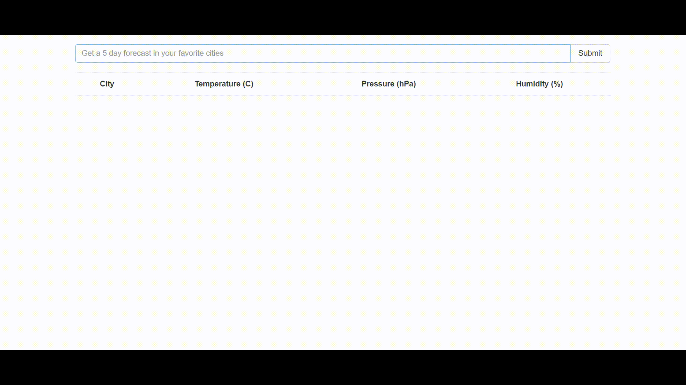

# Weather app

I built this app as part of the Modern React With Redux Course by Stephen Grider. I integrated calls to the open weather maps and google maps API's to provide temperature, pressure, and humidity information as well as a map of the searched city. The charts were made using the Sparklines library.



### Getting Started

There are two methods for getting started with this repo.

#### Familiar with Git?
Checkout this repo, install dependencies, then start the gulp process with the following:

```
> git clone https://github.com/StephenGrider/ReduxSimpleStarter.git
> cd WeatherApp
> npm install
> npm start
```

#### Not Familiar with Git?
Click [here](https://github.com/StephenGrider/ReactStarter/releases) then download the .zip file.  Extract the contents of the zip file, then open your terminal, change to the project directory, and:

```
> npm install
> npm start
```
